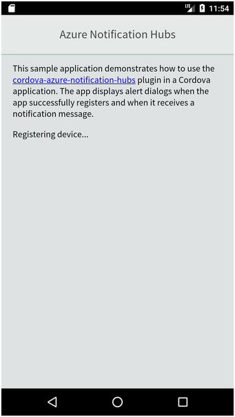
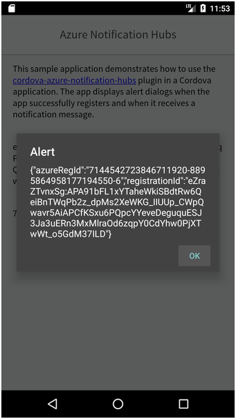
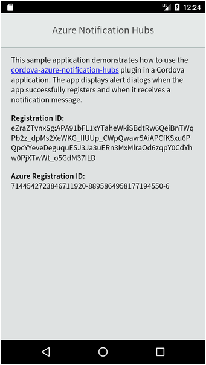
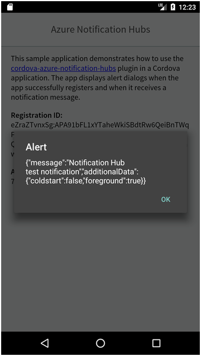

# Azure Notification Hubs Cordova Sample

This sample project demonstrates how to build an Apache Cordova application that works with [Azure Notification Hubs](https://azure.microsoft.com/en-us/services/notification-hubs/) (ANH). ANH doesn't support Apache Cordova directly, so this project uses the open source [cordova-azure-notification-hubs](https://github.com/derek82511/cordova-azure-notification-hubs) plugin.

Before you can run this app, you must first update the project's configuration file: `/www/js/config.js`.

```JavaScript
const config = {
    hubName: '',
    hubConnectionString: '',
}
```

Populate the `hubName` value with the name of your Azure Notification Hubs Hub and the `hubConnectionString` with the read-only connection string from your Hub's configuration. Refer to the [Azure Notification Hubs documentation](https://docs.microsoft.com/en-us/azure/notification-hubs/) for additional information about these values.

You must also copy your Firebase Cloud Messaging platform `google-services.json` file to the project's root folder.

## Application Operation

When the application launches, if displays a simple introductory screen, then registers the device with Azure Notification Hubs. 



If registration succeeds, the app displays a simple dialog showing the data returned from ANH.



The app also updates the app's main page with the registration details.



When the app receives a notification, it writes the received data to the console and displays a dialog with the date received from ANH.

