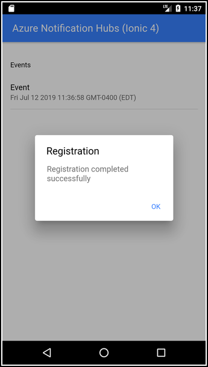

# Azure Notification Hubs Ionic 4 Sample

This repository contains a sample [Ionic 4](https://ionicframework.com/) application that works with [Azure Notification Hubs](https://azure.microsoft.com/en-us/services/notification-hubs/) (ANH). This app is a port of the [Ionic 3](https://github.com/jwargo/azure-notification-hubs-ionic3-sample) sample application (using Ionic 4 and Capacitor instead of Ionic 3 and Apache Cordova).

The ANH SDK doesn't provide direct support for Ionic apps, so this sample uses the third-party [cordova-azure-notification-hubs](https://www.npmjs.com/package/cordova-azure-notification-hubs) plugin. The plugin's a Cordova plugin, and Capacitor supports *most* Cordova plugins, but there's some extra steps you'll have to do to make this work since Capacitor doesn't process the Cordova plugin lifecycle events.

## Project Setup

To start, clone the repository, then open a terminal window, navigate to the cloned project folder, and execute the following command:

```shell
npm install
```

Execute the following command to create and populate the project's `www` folder required by Capacitor:

```shell
ionic build
```

Next, add Capacitor to the project by executing the commands listed below. When prompted for the project's `appID` during the first command below, enter the Firebase App Package Name for this project (from the Firebase console).

```shell
npx cap init
npx cap add android
npx cap add ios
npm install cordova-azure-notification-hubs
```

When the task completes, it will create the project's `capacitor.config.json` file shown below:

```json
{
  "appId": "com.yourcompany.ionicpush",
  "appName": "ionic-4-push-sample",
  "bundledWebRuntime": false,
  "npmClient": "npm",
  "webDir": "www"
}
```

To target Android devices, you must copy your Firebase Cloud Messaging configuration file (`google-services.json`) to the Ionic project's `android/app/` folder.

There's also push configuration steps you must complete in Xcode for your iOS project as well, refer to [Enable the Push Notifications Capability](https://developer.apple.com/documentation/usernotifications/registering_your_app_with_apns) for instructions.

## Notification Hubs Configuration

The app initializes the plugin with the Notification Hubs hub name and connection string. Rather than check those values into the repository, we've pulled them out into a separate configuration file. In the project's `src/app/config.ts` file, you'll find the following:

```javascript
export const config = {
    hubName: '',
    hubConnectionString: ''
};
```

Populate the file's `hubName` and `hubConnectionString` values with the appropriate values from your Azure configuration.

## Running the Application

Run the app by executing `ionic cap run android`. If you get an error about a Cordova plugin missing, run `npm install`, then try again.

When you run the application, the app's home screen displays a list of the Azure Notification Hubs events that occur while the app runs. On startup, the app registers with ANH, so the first event you'll see every time is the Registration event.



The application's main screen is a list view displaying all events in order:


When notifications arrive, the event list updates and the title and message from the notification display in an alert dialog as shown in the following figure.


When you tap on the Registration event, a page opens displaying the registration data as shown in the following figure.


When you tap on a Notification event, a page opens displaying data from the notification as shown in the following figure.


