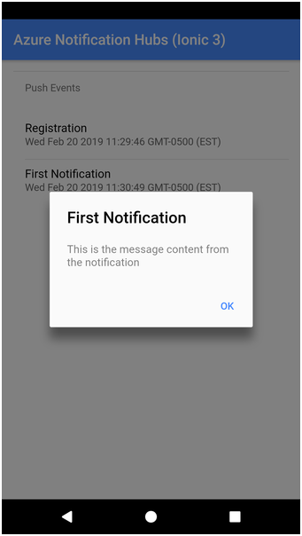
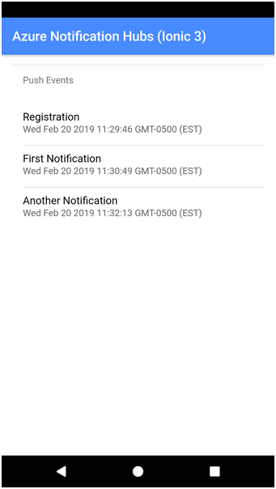
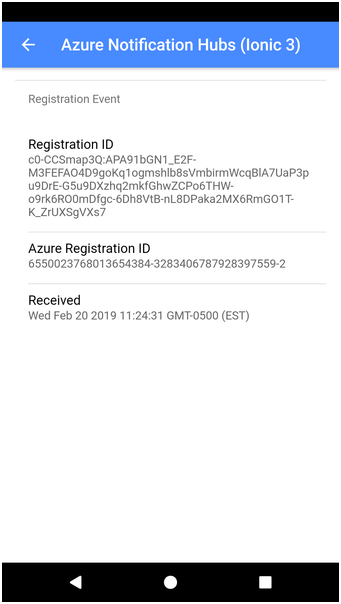
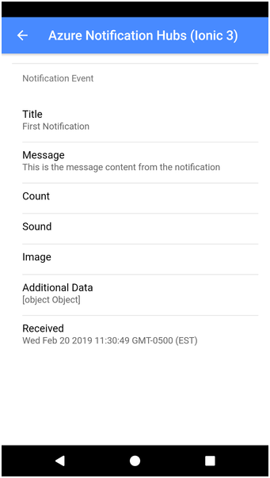

# Azure Notification Hubs Ionic 3 Sample

This repository contains a sample [Ionic 3](https://ionicframework.com/) application that works with [Azure Notification Hubs](https://azure.microsoft.com/en-us/services/notification-hubs/) (ANH). The ANH SDK doesn't provide direct support for Ionic apps, so this sample uses the third-party [cordova-azure-notification-hubs](https://www.npmjs.com/package/cordova-azure-notification-hubs) plugin.

To start, clone the repository, then open a terminal window, navigate to the cloned project folder, and execute the following command:

```shell
npm install
```

This will install the required Node modules as well as any required Cordova plugins. Pay close attention to any error messages that appear during this process; in our testing, the cordova-azure-notification-hubs plugin did not install correctly in some instances. Resolve any issues before continuing.

The app initializes the plugin with the Notification Hubs hub name and connection string. Rather than check those values into the repository, we've pulled them out into a separate configuration file. In the project's `src/app/config.ts` file, you'll find the following:

```Typescript
export const config = {
    hubName: '',
    hubConnectionString: ''
};
```

Populate the file's `hubName` and `hubConnectionString` values with the appropriate values from your Azure configuration.

>Note: For Android, you'll need to copy your Firebase Cloud Messaging configuration file (`google-services.json`) to the appropriate folder in your project's Android project folder. There's also push configuration steps you'll have to complete in Xcode for your project as well.

When you run the application, the app's home screen displays a list of the Azure Notification Hubs events that occur while the app runs. On startup, the app registers with ANH, so the first event you'll see every time is the Registration event. When notifications arrive, the event list updates and the title and message from the notification display in an alert dialog as shown in the following figure.



Events pop on the screen as they happen as shown in the following figure.



When you tap on the Registration event, a page opens displaying the registration data as shown in the following figure.



When you tap on a Notification event, a page opens displaying data from the notification as shown in the following figure.


