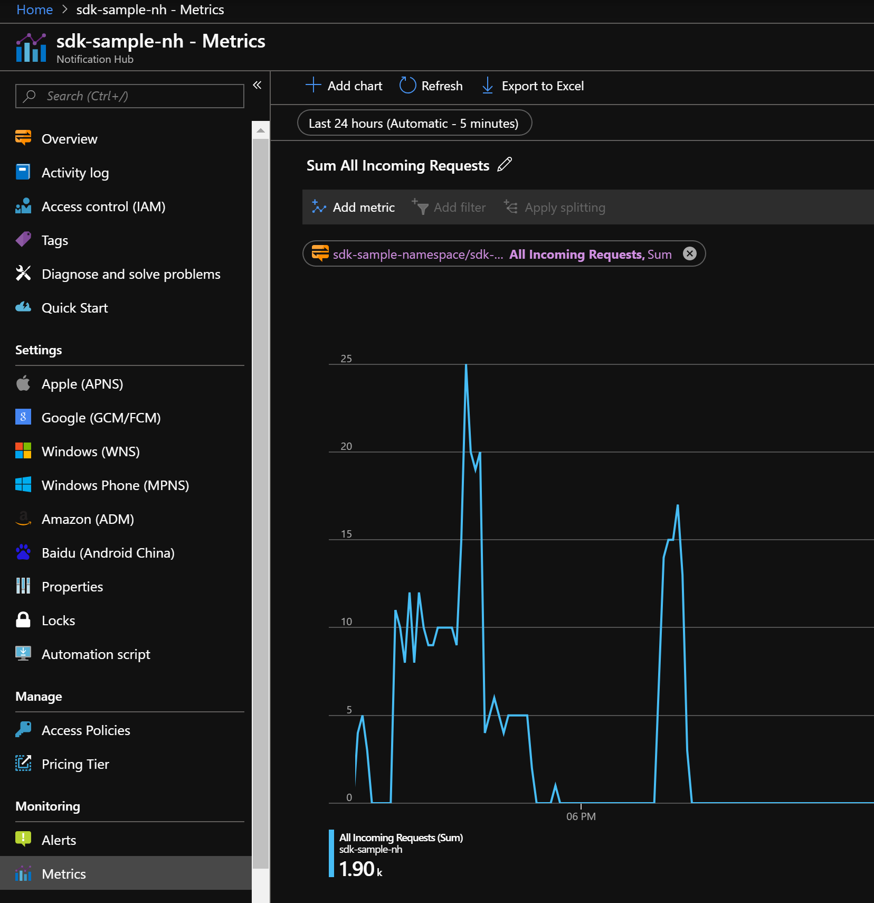
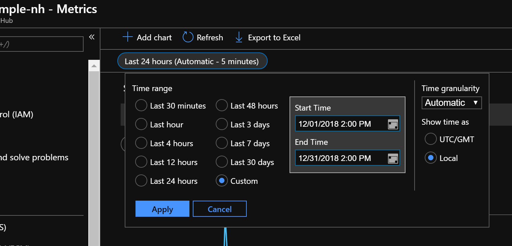
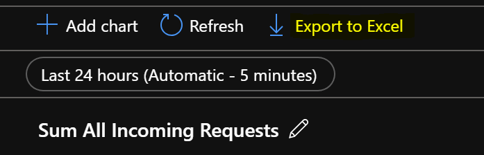

# Fetch Notification Hubs Telemetry from Azure Portal

If all you are looking for is an ad-hoc fetching of metrics, the Azure Portal already exposes this data simply and metrics can be exported straight into Excel.

1. Open https://portal.azure.com
2. Navigate to your Notification Hub that you would like to see metrics for
3. Click the `Metrics` tab:

4. Choose the window of time and metrics that you would like to view

5. Export to Excel if desired

# Fetch Notification Hubs Telemetry Programmatically

1. Open the NHTelemetry.sln in Visual Studio

2. Provide configuration values in App.Config

	a. Follow the steps [here](https://docs.microsoft.com/en-us/azure/active-directory/develop/howto-create-service-principal-portal) to get `AzureADTenantId` (also known as, Directory Id), `AzureADApplicationId`, and `AzureADApplicationKey`.

	b. Ensure you give your Azure AD Application the access to read from your Notification Hub.

3. Run the console application

Some additional changes can be made to query different metrics. For reference, the avilable metrics from Notification Hubs are documented here: [NH All available metrics](https://msdn.microsoft.com/en-us/library/dn458822.aspx). The filter query can be modified to change which metrics you are querying, and the window of time you want.
