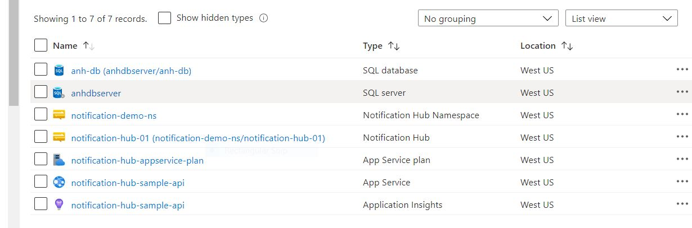
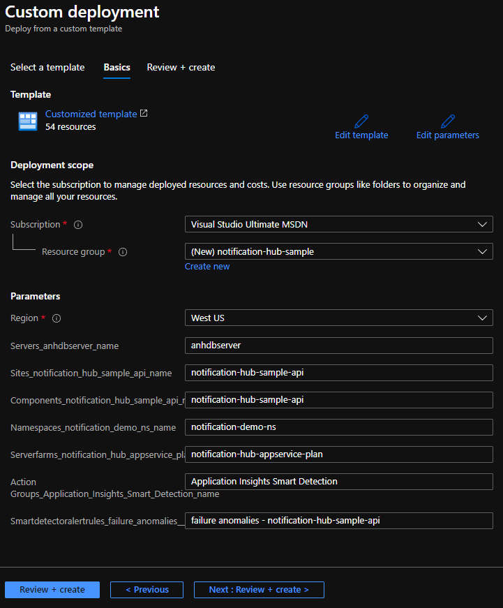
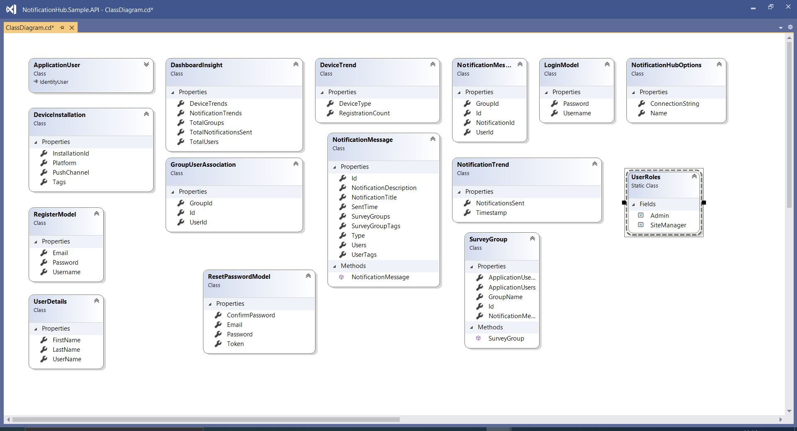

# Contoso Land Survey - Azure Notification Hub Sample

This is a Azure Notification Hub sample application built to demonstrate the capabilities of Azure Notification Hub on multiple platforms. 

## The Architecture?

The solution consists of following entities:
1. **Azure Notification Hub**: An ANH instance configured on Azure.
2. **SQL Server Database:** An SQL Server database hosted on Azure
3. **App Backend**: Web API backend built over .NET 5 which connects with Azure Notification Hub hosted as Azure App Service.
4. **Windows UWP Application:** An UWP application built using React Native acting as manager application to dispatch news and survey information to various users and survey groups. The application also helps creating new users and editing groups a user is assigned to.
5. **Android / iOS Client Apps:** Survey applications which shows users the information dispatched by the manager using UWP manager application.

## Folder Structure
The application consists of two solutions:
1. **NotificationHub.Sample.API:** A ASP.NET Web API solution which acts as a backend. (Requires Visual Studio 2019 Preview and .NET 5 RC SDK)
2. **React Native `app`:** A cross-platform react-native application which allows dispatching notifications with manager login and receive notifications with survey user login.
3. **Azure Template `azure-template`:** Use `parameters.json` and `template.json` files here to deploy all the necessary resources to configure this template in your Azure subscription.
You can use [this link](https://docs.microsoft.com/en-us/azure/azure-resource-manager/templates/quickstart-create-templates-use-the-portal) to know more how to deploy.

## Azure Resource

> You need to create below resources in azure





## Backend

## How to Run?

## Step 1 Configuring backend
Locate `/NotificationHub.Sample.API/appsettings.json` and setup your SQL Server connection string.
```JSON
"ConnectionStrings": {
    "SQLServerConnectionString": "Server=tcp:<SERVER_NAME>,1433;Initial Catalog=<DB_NAME>;Persist Security Info=False;User ID=<DB_USER_NAME>;Password=<PASSWORD>;MultipleActiveResultSets=False;Encrypt=True;TrustServerCertificate=False;Connection Timeout=30;"
  },
```

You can run the API solution locally / on any IIS server or deploy in as Azure Web App Service. Keep the URL of the API ready.

## Step 2 Model class diagram


## Step 3 Notification service 

1) Create a notification service having methods to create and delete installtion.Also create method to send notification to all registered users and to get all registration information.
-------------------------------------------------------------------
```
public interface INotificationService
{
   Task<bool> CreateOrUpdateInstallationAsync(DeviceInstallation deviceInstallation, CancellationToken cancellationToken);
   Task<bool> DeleteInstallationByIdAsync(string installationId, CancellationToken cancellationToken);
   Task<bool> RequestNotificationAsync(NotificationMessage notificationMessage, IList<string> tags, CancellationToken cancellationToken);
   Task<List<DeviceTrend>> GetAllRegistrationInfoAsync();
}
```

## [Step 4](./azure-template/controllers.md) Controllers

## [Step 5](./azure-template/notificationcontroller.md) Notification Controller

## Frontend

## Step 6 Running React Native Solution
Open `app` folder in your preferred terminal / shell window.
1. Run `npm install`
2. Run `npm run start` from one terminal window
3. Open new terminal window in parallel and run `npx react-native run-windows` to run UWP application.

## [Step 7](./azure-template/frontend.md) Changes for frontend

## [Step 8](./azure-template/manageruwp.md) Configure UWP Application

## Running the solution for React Native Windows
To run the manager windows application, run the following two commands in two separate terminal inside `app` folder.
```shell
$ npm run start
```

```shell
$ npx react-native run-windows
```

**Known Issue:** If you get the following error while running the solution, `error MSB4057: The target "Deploy" does not exist in the project.`, this is a known issue with `React Native for Windows`. To fix this please unload the `.csproj` file for `CheckboxWindows` and `ReactNativeAsyncStorage` projects inside Visual Studio after opening `app.sln` inside `app/windows` folder and add following line just before `...</Project>` and reload the project.
```XML
<Target Name="Deploy"/>
```

### React Native For iOS and Android
To run the iOS and Android client application run the following two commands in two separate terminal inside `app` folder.
**Please note you won't be able to receive notifications on iOS simulator.**
```shell
$ npm run start
```

```shell
$ npx react-native run-android
or
$ npx react-native run-ios
```

## Additional Resources
- [Azure Notification Hub Documentation](https://docs.microsoft.com/en-us/azure/notification-hubs/notification-hubs-push-notification-overview)
- [React Native for Windows](https://microsoft.github.io/react-native-windows/)
- [How to send push notifications to react native aplication using azure notification hub](https://docs.microsoft.com/en-us/azure/developer/mobile-apps/notification-hubs-backend-service-react-native)

- [How to send push notifications to Andriod devices using Firebase SDK](https://docs.microsoft.com/en-us/azure/notification-hubs/android-sdk)

## LICENSE
    MIT License

    Copyright (c) Microsoft Corporation.

    Permission is hereby granted, free of charge, to any person obtaining a copy
    of this software and associated documentation files (the "Software"), to deal
    in the Software without restriction, including without limitation the rights
    to use, copy, modify, merge, publish, distribute, sublicense, and/or sell
    copies of the Software, and to permit persons to whom the Software is
    furnished to do so, subject to the following conditions:

    The above copyright notice and this permission notice shall be included in all
    copies or substantial portions of the Software.

    THE SOFTWARE IS PROVIDED "AS IS", WITHOUT WARRANTY OF ANY KIND, EXPRESS OR
    IMPLIED, INCLUDING BUT NOT LIMITED TO THE WARRANTIES OF MERCHANTABILITY,
    FITNESS FOR A PARTICULAR PURPOSE AND NONINFRINGEMENT. IN NO EVENT SHALL THE
    AUTHORS OR COPYRIGHT HOLDERS BE LIABLE FOR ANY CLAIM, DAMAGES OR OTHER
    LIABILITY, WHETHER IN AN ACTION OF CONTRACT, TORT OR OTHERWISE, ARISING FROM,
    OUT OF OR IN CONNECTION WITH THE SOFTWARE OR THE USE OR OTHER DEALINGS IN THE
    SOFTWARE
