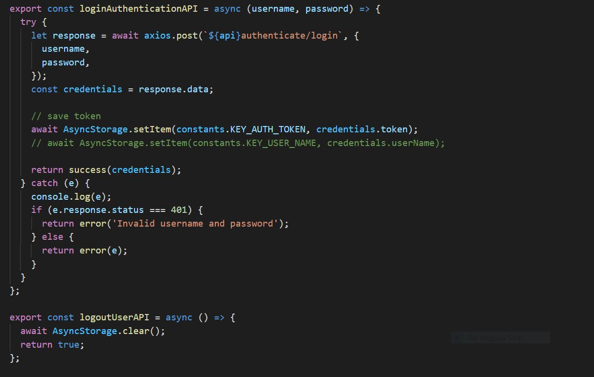
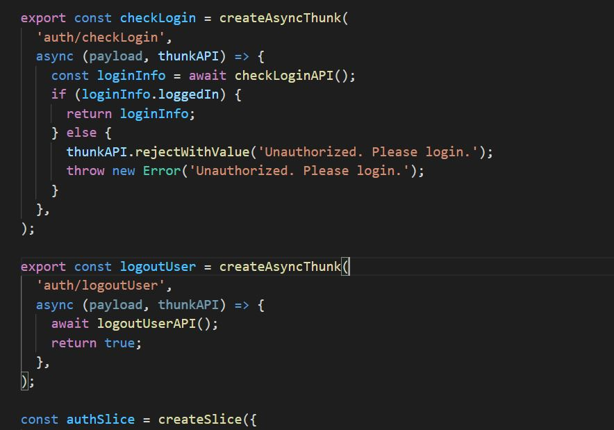
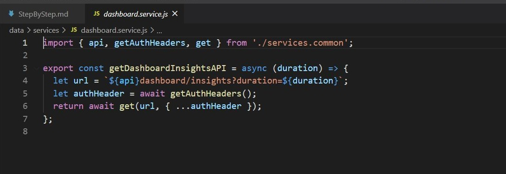
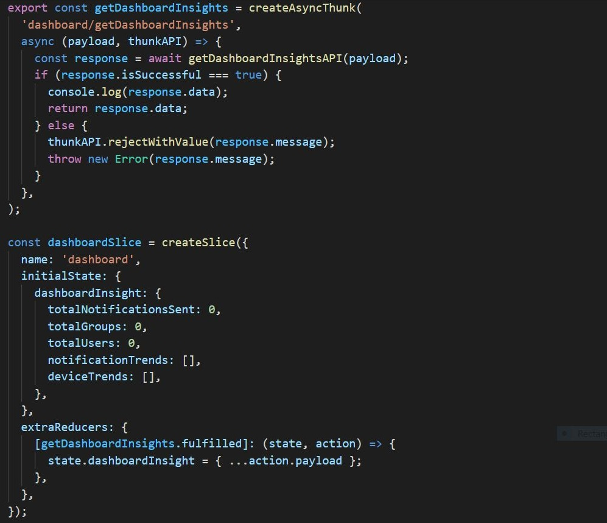

1) To call any backend API you need to first create service like notification.service.js, which will make actual API call.
```
export const sendNotificationAPI = async (userInfo) => {
  let url = `${api}notification/send`;
  let authHeader = await getAuthHeaders();
  return await post(url, userInfo, { ...authHeader });
};

export const getNotificationsAPI = async () => {
  let url = `${api}notification/get`;
  let authHeader = await getAuthHeaders();
  return await get(url, { ...authHeader });
};
```
2) To the service you need to create reducer,like notification.reducer.js
```
export const getNotifications = createAsyncThunk(
  'notification/getNotifications',
  async (payload, thunkAPI) => {
    const response = await getNotificationsAPI();
    if (response.isSuccessful === true) {
      return response.data;
    } else {
      thunkAPI.rejectWithValue(response.message);
      throw new Error(response.message);
    }
  },
);

export const sendNotification = createAsyncThunk(
  'notification/sendNotification',
  async (payload, thunkAPI) => {
    const response = await sendNotificationAPI(payload);
    if (response.isSuccessful === true) {
      return response.data;
    } else {
      thunkAPI.rejectWithValue(response.message);
      throw new Error(response.message);
    }
  },
);

const notificationSlice = createSlice({
  name: 'notification',
  initialState: {
    notifications: [],
  },
  extraReducers: {
    [getNotifications.fulfilled]: (state, action) => {
      state.notifications = action.payload;
    },
    [sendNotification.fulfilled]: (state, action) => {
      state.notifications.push(action.payload);
    },
  },
});

export default notificationSlice.reducer;
```
3) To call reducer first you need import it using below code.

`import { getNotifications, sendNotification } from '../data/reducers/notification.reducer';`

You can write below code to call reducer API for sending and gettting notications.
```
  const postNotification = async () => {
    console.log('sending notification...');
    setLoading(true);
    try {
      let res = await dispatch(sendNotification(notificationDraft));
      if (res.error) {
        console.log(res.error.message);
        Alert.alert('Error Sending Notification!', res.error.message, [{ text: 'Okay' }]);
      } else {
        dispatch(getNotifications());
        navigation.navigate('Notifications');
      }
    } catch (e) {
      console.log(e);
      Alert.alert('Error Sending Notification!', e.message, [{ text: 'Okay' }]);
    } finally {
      setLoading(false);
    }
  }
```
4) In same way you can call authication API. Here are code snippet for service and reducer.


--------------------------------------------------------


5) In same way you can call dashboard API. Here are code snippet for service and reducer.


----------------------------------------------------------

