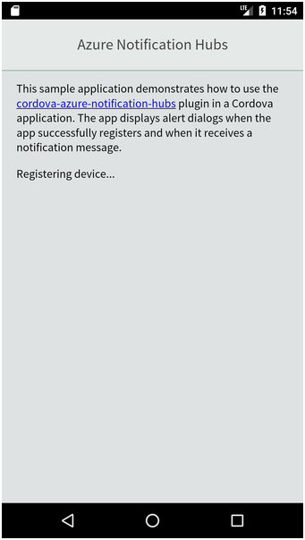
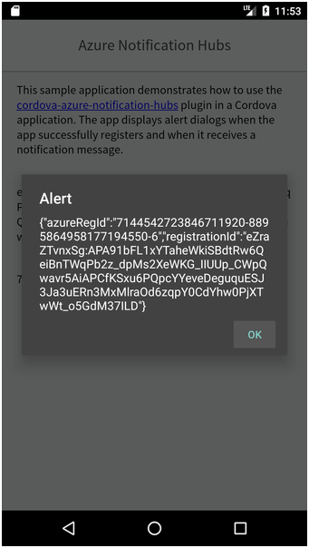
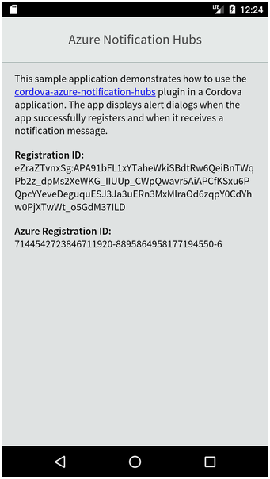
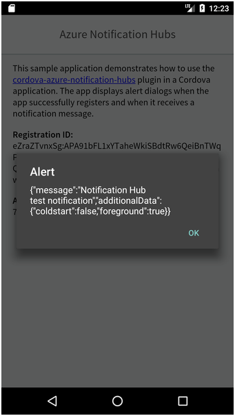

# Azure Notification Hubs Cordova Sample

This sample project demonstrates how to build an Apache Cordova application that works with [Azure Notification Hubs](https://azure.microsoft.com/en-us/services/notification-hubs/) (ANH). ANH doesn't support Apache Cordova directly, so this project uses the open source [cordova-azure-notification-hubs](https://github.com/derek82511/cordova-azure-notification-hubs) plugin.

To start, clone the repository, then open a terminal window, navigate to the cloned project folder, and execute the following command:

```shell
npm install
```

This will install the required Node modules as well as any required Cordova plugins. Pay close attention to any error messages that appear during this process; in our testing, the cordova-azure-notification-hubs plugin did not install correctly in some instances. Resolve any issues before continuing.

The app initializes the plugin with the Notification Hubs hub name and connection string. Rather than check those values into the repository, we've pulled them out into a separate configuration file. In the project's `src/app/config.ts` file, you'll find the following:

```Typescript
export const config = {
    hubName: '',
    hubConnectionString: ''
};
```

Populate the file's `hubName` and `hubConnectionString` values with the appropriate values from your Azure configuration.

For Android, you must copy your Firebase project's Cloud Messaging configuration file (`google-services.json`) to the appropriate folder in your project's Android project folder. There's also push configuration steps you'll have to complete in Xcode for your project as well. The project's `config.xml` file's `widget` element's `id` attribute must match the app ID you provided in your Firebase project configuration.

```
<widget id="com.yourcompany.cdva-push" version="1.0.0" xmlns="http://www.w3.org/ns/widgets" xmlns:cdv="http://cordova.apache.org/ns/1.0">
```

## Application Operation

When the application launches, if displays a simple introductory screen, then registers the device with Azure Notification Hubs. 



If registration succeeds, the app displays a simple dialog showing the data returned from ANH.



The app also updates the app's main page with the registration details.



When the app receives a notification, it writes the received data to the console and displays a dialog with the date received from ANH.

